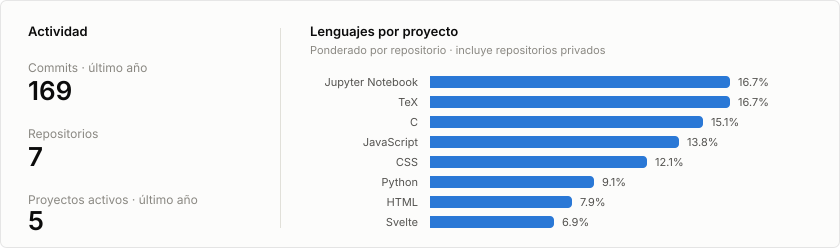

# Edgar Schaddaí

**Ingeniero Mecatrónico** · Estudiante de Maestría en Ciencias con Orientación en Robótica — [CIMAT](https://www.cimat.mx/)

Trabajo en la intersección de la robótica, la visión por computadora y el aprendizaje profundo, con interés particular en aplicaciones agrícolas y sistemas hápticos.

## Líneas de trabajo

- **Visión artificial aplicada al agro** — Detección temprana de plaga de gusano cogollero (*Spodoptera frugiperda*) en maíz mediante modelos de detección de anomalías (DINOv2, SAM 2) y evaluación rigurosa libre de fuga de datos.
- **Robótica y háptica** — Diseño y control de un sistema háptico de 2 GDL con entorno virtual (tesis de ingeniería), integrando mecánica, electrónica y software.
- **Herramientas de investigación** — Desarrollo de **SciSight**, aplicación de escritorio (Tauri + Svelte + Python) para búsqueda académica multi-fuente, gestión de biblioteca y resumen asistido por IA local.

## Stack

`Python` · `PyTorch` · `OpenCV` · `C/C++` · `MATLAB` · `JavaScript / Svelte` · `Rust (Tauri)` · `LaTeX` · `Git`

## Formación

- **M.C. Robótica** — Centro de Investigación en Matemáticas (CIMAT)
- **Ing. Mecatrónica** — Instituto Tecnológico Superior de Jerez

## Estadísticas

<picture>
  <source media="(prefers-color-scheme: dark)" srcset="assets/stats-dark.svg">
  
</picture>

---

📫 Contacto: [GitHub](https://github.com/edgarSchaddai)
